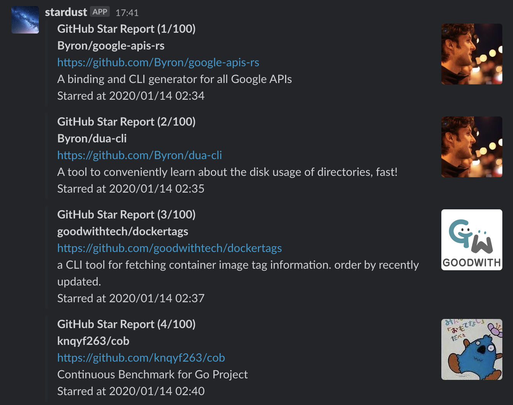

# stardust

Report a summary what GitHub repositories you recently have starred.

For example, you can get a report about what repositories you have starred in the week on every Sunday.

## Run on Cloud Run

Before push the above button, you need to set up the `app.json`.
The example is [app.example.json](app.example.json).
The detailed document is [here](https://github.com/GoogleCloudPlatform/cloud-run-button#customizing-deployment-parameters).

Using it with Cloud Scheduler is recommended.

## Report Platforms

The supported report platforms are below.

- Slack

## License

[MIT](LICENSE)
